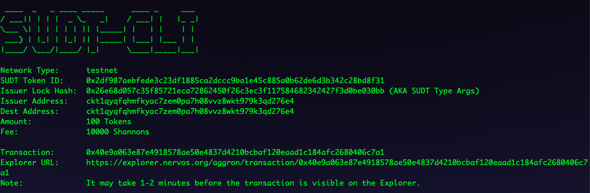

# Gitcoin: 4) Issue An SUDT Token On Layer 1 And Deposit It To Layer 2

## 1. Funded layer 1 address (link) 

https://explorer.nervos.org/aggron/address/ckt1qyqfqhmfkyac7zem0pa7h08vvz8wkt979k3qd276e4

## 2. sudt-cli console output

## 3. Transaction ID created by sudt-cli (link)

https://explorer.nervos.org/aggron/transaction/0x40e9a063e87e4918578ae50e4837d4210bcbaf120eaad1c184afc2680406c7a1

## 4. Console output from account-cli tool

